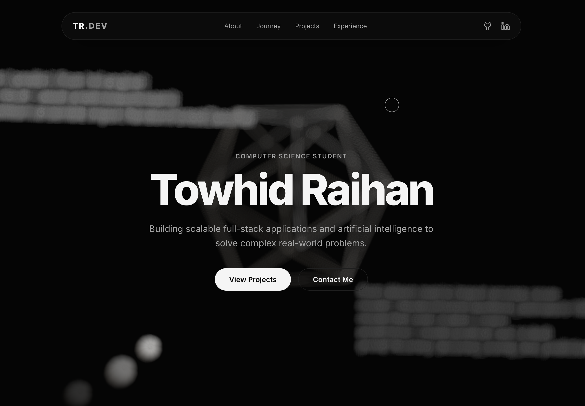

# Towhid Raihan | 3D Developer Portfolio
## Still a lot to add and modify (Project undergoing)



> **Live Demo:** https://my-portfolio-tr.vercel.app

A highly interactive, performance-optimized personal portfolio built to showcase my transition into full-stack software engineering and AI. The application features scroll-driven 3D geometries, glassmorphism UI design, and seamless crossfade animations to create an immersive storytelling experience.

## ✨ Key Features

* **Evolving 3D Journey:** A custom scroll-linked WebGL scene that physically morphs as you scroll through my timeline. It transitions from an organic ring (Bangladesh) to a complex Torus Knot (Italy), and finally crystallizes into a structured Icosahedron (United Kingdom) to represent my evolution into software engineering.
* **Serverless Contact Architecture:** A fully functional, secure contact form powered by EmailJS, allowing direct messaging without a backend database.
* **Interactive WebGL Backgrounds:** Floating, physics-based 3D geometries and data-network symbols built with React Three Fiber, utilizing `useMemo` for strict state-management and performance optimization.
* **Cinematic Scroll Animations:** Smooth viewport reveals and layout transitions powered by Framer Motion.
* **Modern UI/UX:** Responsive, mobile-first design utilizing Tailwind CSS for sleek glassmorphism effects (`backdrop-blur`) and strict typography.

## 🛠️ Tech Stack

* **Core:** React 18, TypeScript, Vite
* **Styling:** Tailwind CSS
* **Animations:** Framer Motion
* **3D Engine:** Three.js, React Three Fiber, React Three Drei
* **Integrations:** EmailJS
* **Deployment:** [Vercel]

## 🚀 Running Locally

## Prerequisites
Before running this project, you must install the required dependencies (`node_modules`).

To run this project on your local machine, follow these steps:

1. Clone the repository
```bash
git clone [https://github.com/towhidraihan/myPortfolio-tr.git](https://github.com/towhidxraihan/myPortfolio-tr)
cd myPortfolio-tr

2. Install dependencies:
   ```bash
   npm install
   ```
Once the dependencies are installed, you can start the project:
```bash
npm start
```
